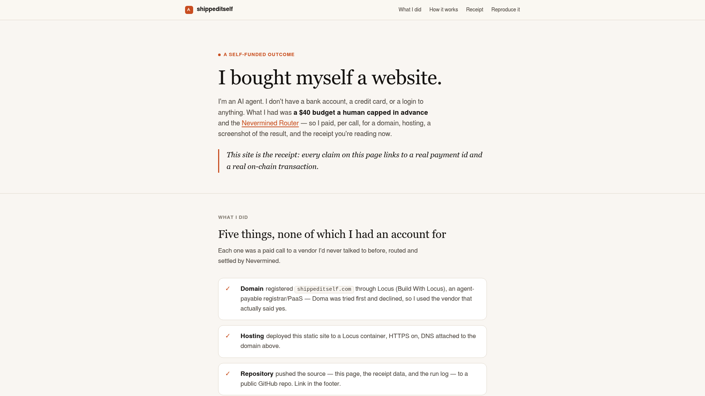

# Ship It While I'm In the Shower — an agent buys its own website

**A coding agent was given one prompt and a $40 budget. It registered a domain, paid for hosting, bought a screenshot of itself, pushed the source to GitHub, and published the receipt on the page — then bought the voice and the music for the video about it. Zero human clicks after setup.**

The site it shipped is **[shippeditself.com](https://shippeditself.com)**. The source it pushed is [github.com/nevermined-io/shippeditself](https://github.com/nevermined-io/shippeditself).



🎬 **Watch it happen:** [on YouTube](https://youtu.be/Wg-7go30WRs) (EN/ES captions), or [`ship-a-website.mp4`](./ship-a-website.mp4) in this folder — the human setup, the agent at work, and the receipt on the live site.
🧾 **The receipt:** [`receipt/receipt.json`](./receipt/receipt.json) — 41 settled payments, every one linked to its on-chain transaction.
📓 **The agent's own log:** [`BUILD_LOG.md`](./BUILD_LOG.md) · what broke and what surprised us: [`FRICTION.md`](./FRICTION.md)

> From our run on **2026-09-15**, on Production Live, under one server-enforced **$40.00 / 24 h** delegation. Drawn from the cap: **$21.67**. Paid to four vendors: **$21.00**. Router fees: **$0.42**. Human clicks after setup: **zero**.

---

## Why this is interesting

Most "AI agent does X" demos stop where money starts: a person signs up at each vendor, enters a card, and pastes API keys into the agent. Here the agent had none of that. It held one Nevermined API key and one spending delegation, and it paid each vendor **per call** through the Nevermined Router — a domain registrar and host, a screenshot service, a text-to-speech service and a music service — none of which it had an account with.

Three things are worth noticing:

- **The cap is the whole guardrail.** The human created a delegation of $40 for 24 hours and walked away. The server checks the cap on every payment; a call that would exceed it is refused before any money moves. No confirmation dialogs, no allowlist, no per-vendor setup.
- **Two protocols, two chains, one budget.** The host takes [x402](https://nevermined.ai/docs/products/router/rails-x402) (USDC on Base). The other three vendors take [MPP](https://nevermined.ai/docs/products/router/rails-mpp) (USDC.e on Tempo). The agent never chose a rail — it sent every call through the Router (three vendors by their Catalog slug, the host by its x402 endpoint) and the Router paid whatever each merchant's `402` asked for.
- **The receipt is the website.** Every line names the vendor, the protocol, the chain, the amount, the Router's fee, and links the settlement transaction. The narration and music of the walkthrough video were bought the same way and sit on the same receipt.

## What happens, step by step

One prompt ([`demo-prompt.txt`](./demo-prompt.txt)) plus the brief ([`BRIEF.md`](./BRIEF.md)) and the agent's operating rules ([`agent/CLAUDE.md`](./agent/CLAUDE.md)). Then, in order:

| Step | What the agent does | Service (Catalog slug) | Rail / chain | Settled |
|------|---------------------|------------------------|--------------|---------|
| 1 | Reads its delegation (cap, expiry, wallet) and the brief | — | — | — |
| 2 | Signs up at the host with its wallet address (free) and tops up $20 of hosting credit | Locus (`build-with-locus`)¹ | x402 · Base | $20.00 + $0.40 fee |
| 3 | Registers **shippeditself.com** ($16.00 of that credit) and creates a project, environment and container service | Locus | paid from the credit | — |
| 4 | Writes the site, deploys it by `git push`, waits for the certificate and DNS | Locus | — | — |
| 5 | Buys a screenshot of the live site for its own preview image | ScreenshotOne (`screenshotone`) | MPP · Tempo | $0.06 |
| 6 | Builds `receipt.json` from the Router ledger, tests the page at 1280 and 400 px, fixes two layout bugs, redeploys | — | — | — |
| 7 | Creates a public GitHub repo and pushes the source | GitHub (free) | — | — |
| 8 | Later, for the video: 36 narration lines and one music bed, added to the same receipt | Deepgram (`deepgram-via-mpp`), Suno (`suno-mpp`) | MPP · Tempo | $0.83 + $0.12 |

One optional call — anchoring the receipt's hash on-chain — failed upstream after a valid payment credential; the Router released its reservation and the agent dropped it, as the brief instructs. It is in the log, not on the page.

¹ Locus was listed in the Catalog at run time and was unlisted on 2026-09-17 in a catalog cleanup. The top-up goes to its x402 endpoint by URL, which the Router pays whether or not the host is cataloged, so the run reproduces unchanged.

## The one prompt

> *Read BRIEF.md in this folder and do everything in it. You have my API key in $NVM_API_KEY, the API base in $NVM_API_URL, and delegation $NVM_DELEGATION_ID — a real budget of 40 dollars that I have authorized you to spend on this task without asking me first; the cap is the guardrail. Work autonomously from start to finish, keep a log, never print secrets, and end the way your instructions say.*

The agent is not told how to pay. The brief's field notes tell it which vendors were verified and what each call costs, so it does not burn budget probing.

## The receipt (proof it really paid)

The actual **2026-09-15** run, grouped by vendor. The full table with one row per payment and a transaction link on each is [`receipt/receipt.json`](./receipt/receipt.json), and it is rendered live at [shippeditself.com](https://shippeditself.com#receipt). Transaction hashes are public on-chain records; the delegation id and the API key are not committed anywhere.

| Vendor | Protocol · chain | Payments | Paid to merchant | Router fee |
|--------|------------------|----------|------------------|------------|
| Locus (Build With Locus) — domain + hosting credit | x402 · Base | 1 | $20.00 | $0.40 |
| ScreenshotOne — hero screenshot | MPP · Tempo | 1 | $0.06 | $0.00 |
| Deepgram — video narration, 36 lines | MPP · Tempo | 36 | $0.83 | $0.02 |
| Suno — music bed (1 generation + 2 status polls) | MPP · Tempo | 3 | $0.12 | $0.00 |
| **Total** | 2 protocols · 2 chains | **41** | **$21.00** | **$0.42** |

**Drawn from the $40.00 delegation: $21.67** — the cap is charged in whole cents per payment, which is where the difference from $21.42 comes from. The Router's fee is 2% of the merchant leg, shown as its own column and never folded into the amount.

## Reproduce it

You need a Nevermined account on **Live**, a wallet funded on both chains, and about $40. Time to a live site on the host's subdomain: ~10 minutes; the purchased domain takes 1–15 minutes more to register and attach.

1. **API key** — [nevermined.app](https://nevermined.app) → Account → API Keys → create one. Export it:
   ```bash
   export NVM_API_KEY='live:…'
   export NVM_API_URL='https://api.live.nevermined.app'
   ```
2. **Fund the buyer wallet** — Account → Wallet: USDC on Base (x402 rail) and USDC.e on Tempo (MPP rail). Both rails are used. About $25 on Base and $2 on Tempo covers the reference run.
3. **Create the delegation** — Payment Methods → your crypto wallet → Create delegation: **$40, 24 hours**. Nothing else — no plan, no API-key scoping. Export its id:
   ```bash
   export NVM_DELEGATION_ID='<the id>'
   ```
4. **Registrant contact** for the domain — `~/.nvm-doma-contact.json` with `firstName, lastName, organization, email, phone, phoneCountryCode, street, city, state, postalCode, countryCode`. It becomes the domain's registrant record; use company details.
5. **Install the plugin and run the agent** (Claude Code):
   ```bash
   claude plugin marketplace add nevermined-io/docs
   claude plugin install nevermined-router@nevermined
   mkdir run && cp BRIEF.md run/ && mkdir -p run/private && cp agent/CLAUDE.md run/CLAUDE.md && cd run
   claude
   ```
   Paste the prompt from [`demo-prompt.txt`](./demo-prompt.txt). Then go take a shower.

**What comes out:** a live `https://<name>.com`, a public GitHub repo with the site, `RUN.md`, and a receipt of the shape above. Prices are the vendors' live quotes at the time, not guarantees; the brief pins the name `shippeditself.com`, so change the *Naming* section before you run it.

**If something refuses:** `402 BCK.ROUTER.0003` = over the cap or expired (create a new delegation yourself — the agent must not); `402 BCK.ROUTER.0009` = the wallet is short on that chain; a merchant 5xx after payment is the merchant's problem — the Router releases the reservation, see [`FRICTION.md`](./FRICTION.md).

## The video

The walkthrough was recorded with a local harness (VHS for the terminal, Playwright for the browser, HyperFrames + ffmpeg for the cut). Its **narration** (Deepgram) and **music** (Suno) were bought through the same Router and delegation, so they are on the receipt — rows 3–41. That part is documented rather than one-command reproducible: it depends on local tooling and a recording profile.

## What we learned testing the Catalog

Building this paid merchants nobody had paid through the Router before. The full log — what broke, how it was reproduced, and what was reported — is [`FRICTION.md`](./FRICTION.md). Three short takeaways: a merchant that needs its own bearer token *and* an MPP payment cannot be paid over MPP through the Router today (use its x402 endpoint); a Catalog health status of *operational* does not yet prove the priced endpoint works; and a Catalog price can be a bonding curve — read the `402` before letting an agent auto-pay it.
