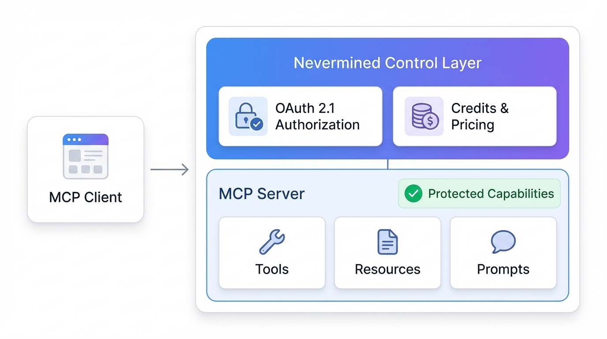
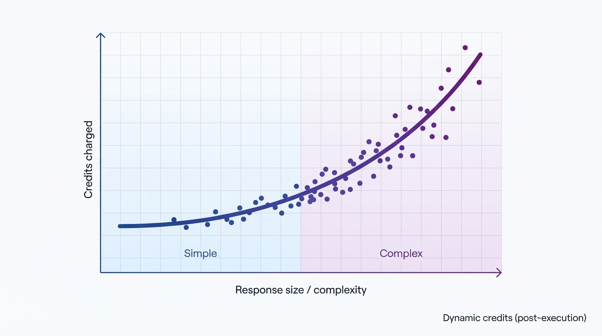
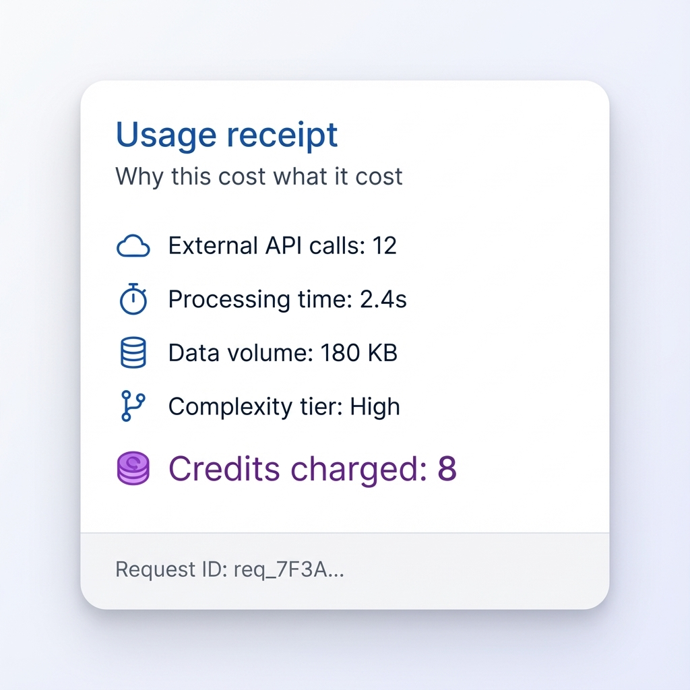
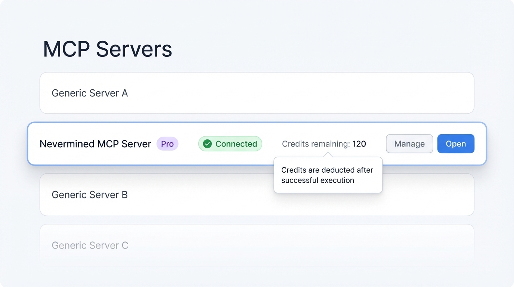
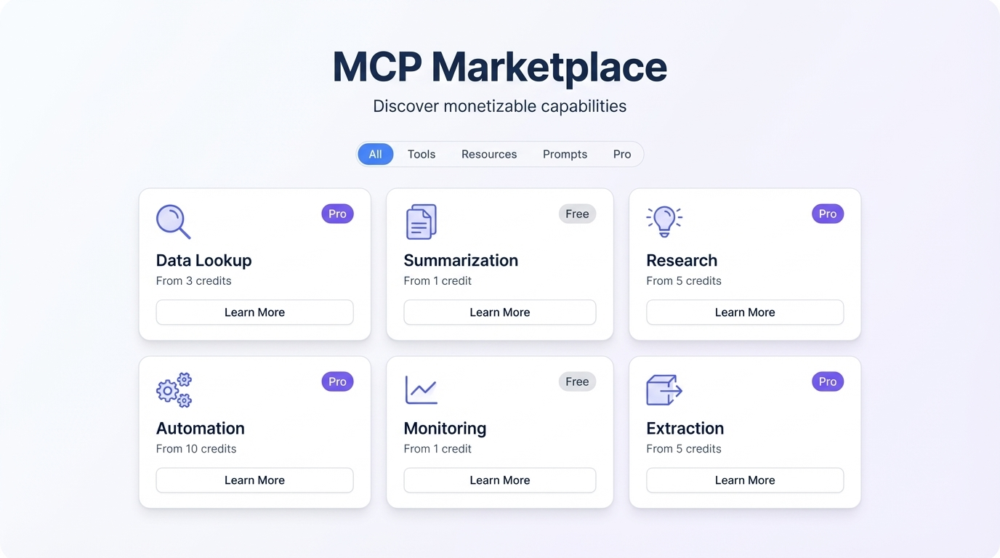
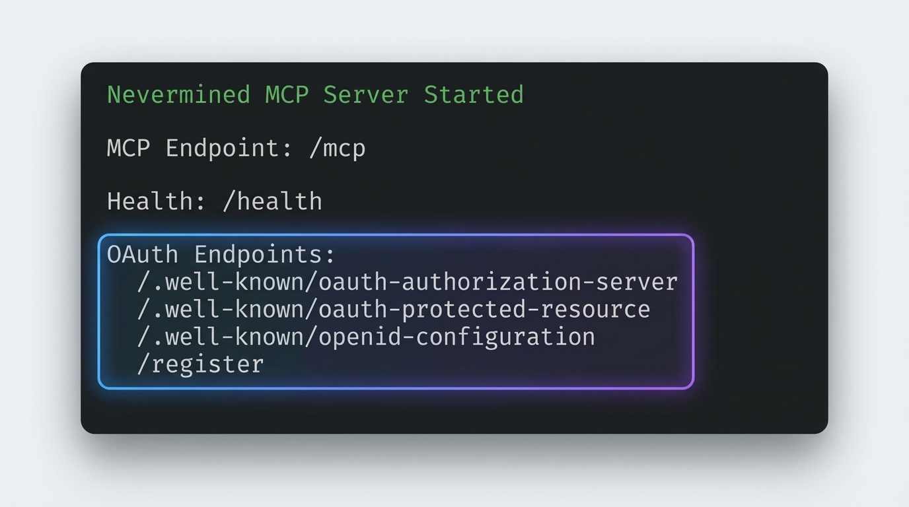

# Monetizing MCP Servers with Nevermined: Authorization that feels native

There’s a moment every team hits when an MCP server stops being a fun prototype.

It works. It’s useful. People want it inside Cursor, Claude Desktop, and other clients. Suddenly it’s being used in real workflows—and now the product questions show up:

Who’s allowed to use this?

How do we charge for it?

How do we avoid building (and maintaining) a fragile auth + billing stack around every single tool?

This post is about what Nevermined adds to MCP to answer those questions—without turning “build an MCP server” into “implement OAuth, session management, pricing, and a paywall from scratch”.

---

## MCP is capability. Products need *control*.

MCP gives you a standard way to expose **tools**, **resources**, and **prompts**. That standard is a big deal: it lets agents discover what exists and how to call it.

But MCP intentionally doesn’t solve the commercial layer: authentication, user consent, access control, and pricing. That’s not a criticism—it’s simply where product reality begins.

When you try to operate an MCP server in the real world, the “missing layer” becomes obvious:

- You need a connection flow users recognize and trust.
- You need guardrails that prevent abuse (or accidental overuse).
- You need pricing that feels fair across cheap vs expensive calls.
- You need visibility: support teams must be able to trace “what happened” when something goes wrong.

Teams usually stitch this together manually. It works… until it doesn’t. Every custom OAuth setup becomes a maintenance burden. Every bespoke pricing layer becomes another set of edge cases.

Nevermined’s MCP module takes the opposite approach: **authorization and monetization should feel native to MCP**.

---

## A user journey: from “Connect” to “Done” (Cursor example)

Let’s describe the experience the way a user feels it—because that’s what determines adoption.

1. The user adds an MCP server URL inside Cursor.
2. The user clicks **Connect**.
3. A browser window opens for authorization (login/consent). If the plan hasn’t been purchased—or credits are exhausted—the payment flow is triggered.
4. Cursor returns with an access token.
5. Now the user just… uses the tool. Like any other capability in their client.

No weird manual steps. No “copy this token” instructions. No custom integration in the client.

That’s the bar: authorization and monetization should be invisible when everything is valid, and explicit only when a user needs to consent or pay.

---

## What Nevermined adds (in product terms)

Instead of describing “endpoints” or “transports”, it’s clearer to describe the product outcomes:

### Automatic OAuth 2.1 so MCP clients connect safely

Nevermined makes your MCP server behave like a well‑behaved OAuth‑protected service. That matters because it unlocks:

- A predictable consent + login experience
- Standard client behavior (Cursor/Claude don’t need special handling)
- A security model users already recognize

The key point is not “which endpoint exists”; it’s that **standard MCP clients can self‑serve the connection flow** and then operate normally.

### Authorization context: visibility into “who is calling”

When an MCP server becomes a product, you need to answer questions like:

- Which agent/client is using this?
- Which request caused a spike?
- Which call correlates with a user complaint?

Nevermined injects a lightweight authorization context into your handlers with identifiers such as an agent ID and a per‑request ID. Product-wise, that translates to **supportability** and **accountability**: you can tie usage to sessions, plans, and user journeys.

### Credits that can be dynamic (pricing based on value, not just “a call happened”)

Most paywalls are flat: “1 call = 1 price”. That breaks down quickly when your MCP server has:

- Cheap calls (cached data, simple lookup)
- Expensive calls (multi-step workflows, external APIs, heavy computation)

Nevermined supports dynamic credit calculation that runs *after* a handler returns. That “after” is the important product insight: you can price based on what was actually delivered—and what it took to deliver it.

This enables pricing models that feel fair:

- Short/simple responses cost less
- Long/complex responses cost more
- Calls that use premium external APIs cost more

---

## Why this matters beyond demos

Most MCP examples are intentionally simple: one tool, one call, one response.

But real MCP servers quickly become more variable in cost and value. They might:

- Query external services with rate limits, quotas, or per-request costs
- Chain multiple steps (retrieve → transform → enrich → summarize)
- Aggregate across several sources before returning a single answer
- Produce outputs that vary a lot in size (a short response vs a full report)

In that world, flat pricing (“every call costs the same”) becomes either unfair to users or unsustainable for providers. Dynamic credits are the lever that lets pricing follow reality: charge based on the value delivered and the work performed.

A practical pattern is to include a small “receipt-like” metadata block in the tool result—e.g., number of external API calls, processing time, data volume, or complexity tier—and use that to compute credits. That makes pricing:

- Adjustable over time
- Explainable to users
- Aligned with underlying cost

---

## What changes for product teams

When authorization and monetization are built in, product work becomes simpler—and faster:

- Launch a free tier + paid tier without redesigning the server
- Experiment with pricing safely (dynamic credits)
- Introduce premium tools/resources without duplicating auth logic
- Support enterprise needs early (auditing, request tracking)

You don’t need bespoke client integrations. The product story becomes:

**“Add your MCP server, connect once, pay if needed, and use it.”**

---

## Where this goes next

MCP is becoming the universal “capability interface” for agents. Nevermined’s goal is to make the business layer—authorization, pricing, settlement—feel as standard as MCP itself.

That unlocks a future where:

- MCP servers can be sold as products (not just run as demos)
- Marketplaces can list MCP capabilities with predictable pricing
- Usage can be measured and optimized like any other API product

---

## Try it

If you want to see the end‑to‑end experience (OAuth connect + protected tools + dynamic credits), start with the demo server:

`https://github.com/nevermined-io/payments/tree/main/examples/mcp/weather-mcp`

---
 
## Demo

Here’s a short demo showing:

- Creating an MCP server protected with Nevermined authorization
- Starting the server and verifying OAuth endpoints are available
- Connecting from an MCP client and completing the authorization flow
- Calling a protected tool successfully

> [VIDEO PLACEHOLDER] Embed: “Create an MCP server with Nevermined authorization + connect from an MCP client”

---

## Closing thought

MCP makes it easy to expose capabilities.

Nevermined makes it feasible to operate them: **authenticate, authorize, and monetize**—without turning every MCP server into a custom security and billing project.

If you’re building MCP servers that call external APIs, run expensive workflows, or power real products, this is the difference between a demo and a deployable business.

---

### References

- Nevermined Payments SDK: `https://github.com/nevermined-io/payments`
- MCP Weather Demo: `https://github.com/nevermined-io/payments/tree/main/examples/mcp/weather-mcp`
- Model Context Protocol: `https://modelcontextprotocol.io`
- OAuth 2.1: `https://oauth.net/2.1/`

